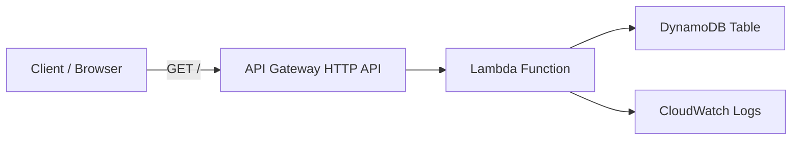

# AWS Serverless API with Terraform

Production-style serverless API deployed with Terraform using AWS Lambda, API Gateway (HTTP API), DynamoDB, and IAM.

## Architecture



Mermaid source: docs/architecture.mmd

## Goals completed

- Built a serverless API with Terraform using:
    - AWS Lambda
    - API Gateway HTTP API
    - DynamoDB
    - IAM roles and policies
- Deployed infrastructure successfully and verified the live endpoint.
- Added architecture documentation and project usage guide.

## Key implementation details

- Endpoint: `GET /` via API Gateway
- Lambda runtime: `Python 3.12`
- Data store: DynamoDB on-demand table
- Infrastructure as Code: Terraform (`AWS` + `Archive` providers)

## Validation evidence

- `terraform validate` passed
- `terraform plan` returned no drift after apply
- API test returned:
    - `ok: true`
    - DynamoDB item payload

## Challenges solved

- IAM permission gaps during deployment (Lambda, API Gateway, DynamoDB, IAM reads)
- Terraform tainted resources reconciled using targeted fixes (`untaint` where appropriate)
- Cleaned repository artifacts and finalized reproducible lock file workflow

## Usage

```bash
terraform init
terraform plan
terraform apply
```

## Test the API

```powershell
$url = terraform output -raw api_endpoint
Invoke-RestMethod -Method GET -Uri $url
```

## Outputs

- `api_endpoint`
- `lambda_function_name`
- `dynamodb_table_name`

## Cost notes (rough)

- Lambda: pay per request + duration
- API Gateway HTTP API: pay per requests
- DynamoDB on-demand: pay per read/write request units
- CloudWatch Logs: ingestion + storage costs

## Cleanup

```bash
terraform destroy
```

---

### IAM Deep-Dive

**What is IAM?**
- IAM (Identity and Access Management) lets you manage access to AWS resources securely.
- You can create users, groups, and roles, and assign permissions to control who can do what in your AWS account.

**Example: Creating an IAM Role for Lambda**

```hcl
resource "aws_iam_role" "lambda_exec" {
  name = "lambda_execution_role"
  assume_role_policy = jsonencode({
    Version = "2012-10-17",
    Statement = [{
      Action = "sts:AssumeRole",
      Effect = "Allow",
      Principal = {
        Service = "lambda.amazonaws.com"
      }
    }]
  })
}

resource "aws_iam_policy_attachment" "lambda_policy" {
  name       = "attach_lambda_policy"
  policy_arn = "arn:aws:iam::aws:policy/service-role/AWSLambdaBasicExecutionRole"
  roles      = [aws_iam_role.lambda_exec.name]
}
```

**How it fits my architecture:**
- IAM roles are used to give Lambda functions permission to log to CloudWatch, access S3, or interact with other AWS services.
- Always use least privilege: only grant the permissions needed.

---

### S3 Deep-Dive 

**What is S3?**
- Amazon S3 (Simple Storage Service) is a scalable object storage service used to store files, backups, logs, and static website content.
- S3 buckets are containers for your data, and you can control access using policies.

**Why is S3 important?**
- S3 is used for storing and serving files, such as Lambda deployment packages, API responses, or static websites.
- It integrates with other AWS services like Lambda, CloudFront, and IAM.

**Example: Creating an S3 Bucket with Terraform**

```hcl
resource "aws_s3_bucket" "example" {
  bucket = "my-serverless-api-bucket"
  acl    = "private"
}
```

**How it fits my architecture:**
- S3 can store Lambda code, API assets, or logs.
- You can use S3 as the origin for CloudFront to serve static content securely.


### CloudFront Deep-Dive

**What is CloudFront?**
- Amazon CloudFront is a Content Delivery Network (CDN) that securely delivers your content (APIs, websites, files) to users with low latency.
- It caches content at edge locations around the world for faster access.

**Why is CloudFront important?**
- Improves performance by caching and distributing content closer to users.
- Adds security features like HTTPS, access control, and DDoS protection.
- Commonly used to serve static files from S3 or APIs from Lambda/API Gateway.

**Example: Creating a CloudFront Distribution with Terraform**

```hcl
resource "aws_cloudfront_distribution" "example" {
  origin {
    domain_name = aws_s3_bucket.example.bucket_regional_domain_name
    origin_id   = "S3Origin"
  }

  enabled             = true
  default_root_object = "index.html"

  default_cache_behavior {
    allowed_methods  = ["GET", "HEAD"]
    cached_methods   = ["GET", "HEAD"]
    target_origin_id = "S3Origin"
    viewer_protocol_policy = "redirect-to-https"
  }

  viewer_certificate {
    cloudfront_default_certificate = true
  }
}
```

**How it fits my architecture:**
- CloudFront can serve static assets from S3 or API responses from Lambda/API Gateway.
- It helps secure and accelerate your serverless API.

### Network Flow

**How requests move through the architecture:**
- Client sends HTTP request to API Gateway.
- API Gateway routes the request to Lambda.
- Lambda processes the request, reads/writes to DynamoDB, and logs to CloudWatch.
- Response is sent back to the client via API Gateway.

### Security Notes

**Key security practices:**
- IAM roles restrict Lambda permissions (least privilege).
- API Gateway can use authorization and throttling.
- S3 buckets are private by default; access is controlled via policies.
- CloudFront adds HTTPS and DDoS protection.
- No public access to DynamoDB or Lambda.