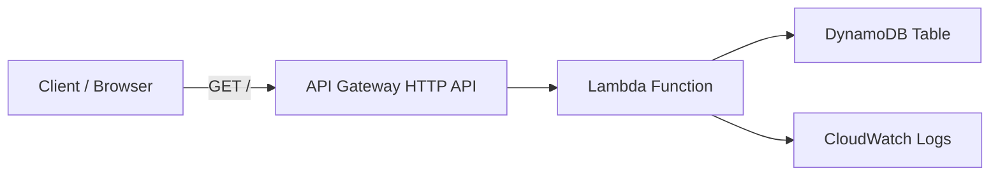

# AWS Serverless API with Terraform

Production-style serverless API deployed with Terraform using AWS Lambda, API Gateway (HTTP API), DynamoDB, and IAM.

## Architecture



Mermaid source: docs/architecture.mmd

## Goals completed

- Built a serverless API with Terraform using:
    - AWS Lambda
    - API Gateway HTTP API
    - DynamoDB
    - IAM roles and policies
- Deployed infrastructure successfully and verified the live endpoint.
- Added architecture documentation and project usage guide.

## Key implementation details

- Endpoint: `GET /` via API Gateway
- Lambda runtime: `Python 3.12`
- Data store: DynamoDB on-demand table
- Infrastructure as Code: Terraform (`AWS` + `Archive` providers)

## Validation evidence

- `terraform validate` passed
- `terraform plan` returned no drift after apply
- API test returned:
    - `ok: true`
    - DynamoDB item payload

## Challenges solved

- IAM permission gaps during deployment (Lambda, API Gateway, DynamoDB, IAM reads)
- Terraform tainted resources reconciled using targeted fixes (`untaint` where appropriate)
- Cleaned repository artifacts and finalized reproducible lock file workflow

## Usage

```bash
terraform init
terraform plan
terraform apply
```

## Test the API

```powershell
$url = terraform output -raw api_endpoint
Invoke-RestMethod -Method GET -Uri $url
```

## Outputs

- `api_endpoint`
- `lambda_function_name`
- `dynamodb_table_name`

## Cost notes (rough)

- Lambda: pay per request + duration
- API Gateway HTTP API: pay per requests
- DynamoDB on-demand: pay per read/write request units
- CloudWatch Logs: ingestion + storage costs

## Cleanup

```bash
terraform destroy
```
